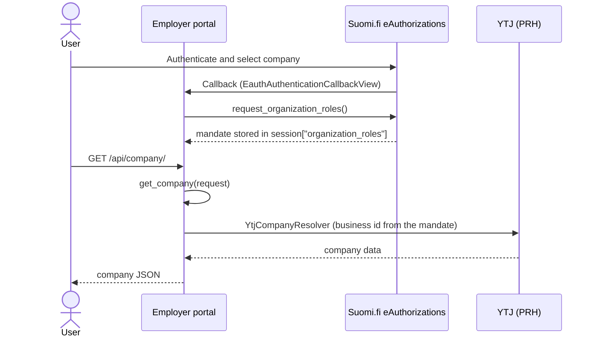

# Fetching company data: a worked example

This is a task-oriented walkthrough of using the company resolvers in a real
application. For the reference (settings, the built-in resolvers, the returned dict
shape), see the [Company data resolvers](../README.md#company-data-resolvers) and
[Public API](../README.md#public-api) sections of the README.

The examples use Django REST Framework on the consumer side, since that is what most
City of Helsinki services use. The library itself only depends on `django` and
`requests`; the DRF, model and view code below lives in *your* application.

Throughout, the running example is a fictional "employer portal" app.

## How it fits into the request lifecycle

`get_company` does not fetch the mandate itself. It reads the "organization roles"
that the eAuthorizations callback already stored in the session, resolves the company
from them, and caches the result. So the natural order is: the user logs in, the
callback stores the mandate, and a later request turns that mandate into company data.



The diagram shows the happy path. When YTJ is unavailable or returns nothing, the chain
falls back to the plain mandate data (name plus business id), which still resolves
successfully but with fewer fields (see [Gotchas](#gotchas)).

## 1. Configure the resolver chain

Try YTJ first, and fall back to the plain mandate data (name plus business id) when
YTJ is unavailable or has nothing:

```python
# settings.py
SUOMIFI_ON_BEHALF_COMPANY_RESOLVERS = [
    "suomifi_on_behalf.company.YtjCompanyResolver",
    "suomifi_on_behalf.company.OrganizationRolesCompanyResolver",
]
```

`YtjCompanyResolver` also needs `SUOMIFI_ON_BEHALF_YTJ_BASE_URL`; see the
[Settings reference](../README.md#settings).

## 2. Turn the resolved data into your own Company

The library returns a dict; persisting and exposing it is your app's job. The pieces
specific to this walkthrough are a model, a small service function to upsert it, and a
serializer:

```python
# employerportal/models.py
from django.db import models


class Company(models.Model):
    business_id = models.CharField(max_length=64, unique=True)
    name = models.CharField(max_length=256)
    company_form = models.CharField(max_length=128, blank=True, default="")
    industry = models.CharField(max_length=256, blank=True, default="")
    street_address = models.CharField(max_length=256, blank=True, default="")
    postcode = models.CharField(max_length=32, blank=True, default="")
    city = models.CharField(max_length=128, blank=True, default="")
```

```python
# employerportal/services.py
from .models import Company

# The org-roles fallback only provides name + business_id, so guard the optional
# fields: only write values that are actually present, never clobber good data with
# blanks from a degraded resolve.
_OPTIONAL_FIELDS = ("company_form", "industry", "street_address", "postcode", "city")


def get_or_create_company(data: dict) -> Company:
    defaults = {"name": data.get("name") or ""}
    for field in _OPTIONAL_FIELDS:
        if value := data.get(field):
            defaults[field] = value

    company, _ = Company.objects.update_or_create(
        business_id=data["business_id"], defaults=defaults
    )
    return company
```

```python
# employerportal/serializers.py
from rest_framework import serializers

from .models import Company


class CompanySerializer(serializers.ModelSerializer):
    class Meta:
        model = Company
        fields = [
            "business_id",
            "name",
            "company_form",
            "industry",
            "street_address",
            "postcode",
            "city",
        ]
```

You also need to register `CurrentCompanyView` (below) in your URLconf at `/api/company/`
and run migrations for the model.

## 3. Use it in a view

```python
# employerportal/views.py
from rest_framework import status
from rest_framework.response import Response
from rest_framework.views import APIView

from suomifi_on_behalf import CompanyResolutionError, get_company

from .serializers import CompanySerializer
from .services import get_or_create_company


class CurrentCompanyView(APIView):
    def get(self, request):
        try:
            data = get_company(request)
        except CompanyResolutionError:
            # No mandate in the session, or no company could be resolved from it.
            return Response(
                {"detail": "No company available for the current session."},
                status=status.HTTP_404_NOT_FOUND,
            )

        company = get_or_create_company(data)
        return Response(CompanySerializer(company).data)
```

## 4. Write a custom resolver

The built-in resolvers cover YTJ and the plain mandate. When your service reads
companies from somewhere else (Palveluvayla / Service Bus, YRTTI for associations, an
internal registry, ...), write your own resolver. A resolver is any callable
`(request) -> dict`. The two rules that matter:

- Read the business id from `request.session["organization_roles"]["identifier"]`
  (the eAuthorizations callback put it there).
- On any failure, raise `CompanyResolutionError` so the chain can fall through to the
  next resolver. Do not let `requests` exceptions escape.

```python
# employerportal/resolvers.py
import requests
from django.conf import settings
from requests.exceptions import RequestException

from suomifi_on_behalf import CompanyResolutionError


class ServiceBusCompanyResolver:
    """Resolve company data from Palveluvayla / Service Bus instead of YTJ."""

    def __call__(self, request) -> dict:
        roles = request.session.get("organization_roles") or {}
        business_id = roles.get("identifier")
        if not business_id:
            raise CompanyResolutionError("No business id in organization roles")

        try:
            response = requests.post(
                settings.SERVICE_BUS_URL,
                json={"businessId": business_id},
                timeout=30,
            )
            response.raise_for_status()
            payload = response.json()
        except RequestException as e:
            raise CompanyResolutionError(str(e)) from e

        company = payload.get("company")
        if not company:
            raise CompanyResolutionError(f"No company found for {business_id}")

        return {
            "name": company["name"],
            "business_id": business_id,
            "company_form": company.get("companyForm", ""),
            "industry": company.get("industry", ""),
            "street_address": company.get("streetAddress", ""),
            "postcode": company.get("postCode", ""),
            "city": company.get("city", ""),
        }
```

Register it ahead of the fallback:

```python
# settings.py
SUOMIFI_ON_BEHALF_COMPANY_RESOLVERS = [
    "employerportal.resolvers.ServiceBusCompanyResolver",
    "suomifi_on_behalf.company.OrganizationRolesCompanyResolver",
]
```

`get_company` does not validate or enforce a schema: it passes through whatever dict your
resolver returns. The example above mirrors the built-in YTJ keys, but you are free to
return a **superset**. For instance, a Service Bus resolver can add integer/code fields
that your `Company` model persists:

```python
return {
    "name": company["name"],
    "business_id": business_id,
    "company_form": company.get("companyForm", ""),
    "company_form_code": company.get("companyFormCode"),  # extra: int legal-form code
    "industry": company.get("industry", ""),
    "industry_code": company.get("industryCode"),          # extra: TOL code string
    "street_address": company.get("streetAddress", ""),
    "postcode": company.get("postCode", ""),
    "city": company.get("city", ""),
}
```

When chaining resolvers, have them agree on a superset of keys so callers see a stable
shape no matter which resolver produced the result.

## 5. Audit logging with signals

`get_company` emits `suomifi_company_resolved` on success and
`suomifi_company_resolution_failed` on failure (payloads in the
[Signals reference](../README.md#signals)). Connect receivers (from your app config's
`ready()`) to record an audit trail:

```python
# employerportal/signals.py
import logging

from django.dispatch import receiver

from suomifi_on_behalf.signals import (
    suomifi_company_resolution_failed,
    suomifi_company_resolved,
)

logger = logging.getLogger(__name__)


@receiver(suomifi_company_resolved)
def on_company_resolved(sender, request, company, **kwargs):
    logger.info("Resolved company %s", company["business_id"])


@receiver(suomifi_company_resolution_failed)
def on_company_resolution_failed(sender, request, error, **kwargs):
    logger.warning("Company resolution failed: %s", error)
```

Because a YTJ outage falls back silently (see Gotchas), these signals are the reliable
place to notice when resolution degrades or fails.

Connect your receivers to the `suomifi_on_behalf.signals` objects specifically. These are
distinct `Signal` instances, not the same objects as any similarly named signals already
in your project (for example if you migrated incrementally from a copy-pasted version of
this code). A receiver wired to a different signal object silently receives nothing.

## 6. Testing your integration

You do not need to run the eAuthorizations login in tests. Seed the mandate into the
session directly (exactly what the callback would have stored), then mock the YTJ call:

```python
# employerportal/tests/test_company_view.py
import re

import pytest
from rest_framework.test import APIClient


@pytest.fixture
def authed_client():
    client = APIClient()
    session = client.session
    session["organization_roles"] = {"identifier": "0877830-0", "name": "Example Oy"}
    session.save()
    return client


@pytest.mark.django_db
def test_current_company_view(authed_client, requests_mock):
    requests_mock.get(
        re.compile(r"avoindata\.prh\.fi"),
        json={
            "companies": [
                {
                    "businessId": {"value": "0877830-0"},
                    "names": [{"name": "Example Oy", "type": "1"}],
                    "companyForms": [
                        {
                            "type": "OY",
                            "descriptions": [
                                {"languageCode": "1", "description": "Osakeyhtio"}
                            ],
                        }
                    ],
                    "mainBusinessLine": {
                        "descriptions": [
                            {"languageCode": "1", "description": "Ohjelmistoala"}
                        ]
                    },
                    "addresses": [
                        {
                            "type": 1,
                            "street": "Example Street 1",
                            "postCode": "00100",
                            "postOffices": [
                                {"languageCode": "1", "city": "Helsinki"}
                            ],
                        }
                    ],
                }
            ]
        },
    )

    response = authed_client.get("/api/company/")

    assert response.status_code == 200
    assert response.data["business_id"] == "0877830-0"
    assert response.data["name"] == "Example Oy"
```

To test the fallback path, seed the same mandate but make the YTJ mock return a 404 or
an error; `get_company` will return `{"name": ..., "business_id": ...}` from the
mandate.

## Gotchas

- **Session caching.** The first successful `get_company` stores the result in
  `request.session["company"]` and every later call returns that cached dict; it never
  refreshes on its own. Force a re-resolve by clearing it:
  `request.session.pop("company", None)`. Be aware the cached data can go stale
  relative to YTJ.
- **Silent degradation.** If YTJ is down or returns nothing, the chain falls back to
  `OrganizationRolesCompanyResolver`, so you get a *successful* (but reduced) result
  with only `name` and `business_id`. If that distinction matters, watch the
  `suomifi_company_resolved` / `suomifi_company_resolution_failed` signals rather than
  relying on an exception.
- **The mandate must already be in the session.** `get_company` does not call the
  eAuthorizations API; it operates on `session["organization_roles"]`. Call it only
  after the eAuthorizations callback has completed. Called without a mandate, it raises
  `CompanyResolutionError`.
