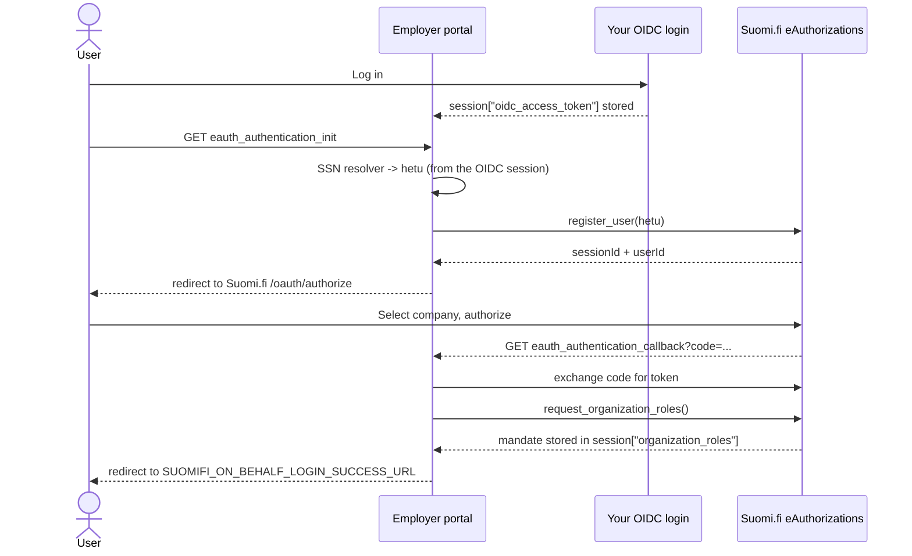

# The eAuthorizations flow and SSN resolution: a worked example

This is a task-oriented walkthrough of wiring up the Suomi.fi eAuthorizations
("Valtuudet") on-behalf flow and plugging in SSN (hetu) resolution. For the reference
(every setting, the built-in resolvers, the signal payloads), see the
[Settings](../README.md#settings), [SSN (hetu) resolvers](../README.md#ssn-hetu-resolvers)
and [Signals](../README.md#signals) sections of the README.

This is the primary flow of the library; once it completes you have the user's mandate
in the session and can fetch company data (see [company-data.md](company-data.md)).

The eAuthorizations views are plain `django.views.View`s wired through your URLconf, so
everything below is plain Django - no DRF required. The running example is a fictional
"employer portal" app.

## How the flow fits together



## Prerequisite: an OIDC-authenticated session

This library builds on an existing OIDC login that your app provides; see
[Concepts](../README.md#concepts) for the background. With the built-in SSN resolvers,
the flow needs just one session key from that login:

- `request.session["oidc_access_token"]` - read by the built-in SSN resolvers to obtain
  the hetu.

A custom SSN resolver may read a different key instead (see section 4).

Everything else is created by the flow itself: `register_user` stores `eauth_id_token`,
the callback's token exchange stores `eauth_access_token`, and the mandate query stores
`organization_roles`. If `oidc_access_token` is missing when the init view runs, SSN
resolution fails and the user is redirected to the error page.

## 1. Wire the URLs

```python
# employerportal/urls.py
from django.urls import include, path

urlpatterns = [
    path("", include("suomifi_on_behalf.urls")),
]
```

This provides two named routes:

- `eauth_authentication_init` (`eauthorizations/authenticate/`) - start the flow.
- `eauth_authentication_callback` (`eauthorizations/callback/`) - Suomi.fi returns here.

Send an authenticated user to `eauth_authentication_init` to begin, and register the
callback URL with Suomi.fi as the redirect URI (always sent as `https://`). See
[Quickstart](../README.md#quickstart).

## 2. Configure the eAuthorizations client and SSN resolution

Set the eAuthorizations client credentials (see the
[Settings reference](../README.md#settings) for the full list), then configure the SSN
resolver chain:

```python
# settings.py

# Try the OIDC userinfo claim first, fall back to Helsinki Profile.
SUOMIFI_ON_BEHALF_SSN_RESOLVERS = [
    "suomifi_on_behalf.ssn.OidcUserinfoSsnResolver",
    "suomifi_on_behalf.ssn.HelsinkiProfileSsnResolver",
]
SUOMIFI_ON_BEHALF_OIDC_USERINFO_ENDPOINT = "https://tunnistus.example.test/openid/userinfo"
```

The resolvers are tried in order until one returns a hetu; if every resolver raises
`SsnResolutionError`, the init view redirects to the error page rather than raising. Put
the cheapest / most authoritative source first and any fallback last.

## 3. Redirects

```python
# settings.py

# Where to send the user after a successful login. Required: the init view raises
# ImproperlyConfigured when it is unset, so a misconfiguration surfaces before the
# user is sent to Suomi.fi.
SUOMIFI_ON_BEHALF_LOGIN_SUCCESS_URL = "https://portal.example.test/dashboard"

# Where to send the user when authorization fails.
SUOMIFI_ON_BEHALF_LOGIN_ERROR_URL = "https://portal.example.test/login-error"

# Validate any dynamic redirect targets (see below).
SUOMIFI_ON_BEHALF_REDIRECT_ALLOWED_HOSTS = ["portal.example.test"]
SUOMIFI_ON_BEHALF_REDIRECT_REQUIRE_HTTPS = True
```

For a dynamic post-login destination (returning the user to the page they started
from), store a `eauth_next_url` in the session before starting the flow:

```python
request.session["eauth_next_url"] = "https://portal.example.test/applications/42"
return redirect("eauth_authentication_init")
```

On success the flow pops `eauth_next_url` and uses it **only if** it passes
`is_safe_redirect_url` (checked against `REDIRECT_ALLOWED_HOSTS` /
`REDIRECT_REQUIRE_HTTPS`); otherwise it falls back to
`SUOMIFI_ON_BEHALF_LOGIN_SUCCESS_URL`.

The redirect settings and the language-segment behavior (a `LANGUAGE_COOKIE_NAME` cookie
is appended to the final URL as a path segment) are documented in the
[Settings reference](../README.md#settings). Build your frontend routes to expect the
language segment.

## 4. Write a custom SSN resolver

A resolver is any callable `(request) -> str` that returns the hetu or raises
`SsnResolutionError`. The simplest customization is a different userinfo claim name:

```python
# employerportal/resolvers.py
from suomifi_on_behalf.ssn import OidcUserinfoSsnResolver


class HetuClaimResolver(OidcUserinfoSsnResolver):
    claim = "hetu"
```

When the hetu lives somewhere other than a plain userinfo claim - say your OIDC login
already decoded it into the session - write a plain callable:

```python
# employerportal/resolvers.py
from suomifi_on_behalf.ssn import SsnResolutionError


def id_token_ssn_resolver(request):
    claims = request.session.get("oidc_id_token_claims") or {}
    ssn = claims.get("national_id")
    if not ssn:
        raise SsnResolutionError("no national_id claim in the ID token")
    return ssn
```

Register whichever you use:

```python
# settings.py
SUOMIFI_ON_BEHALF_SSN_RESOLVERS = [
    "employerportal.resolvers.HetuClaimResolver",
    "suomifi_on_behalf.ssn.HelsinkiProfileSsnResolver",
]
```

> **Signed-JWT userinfo.** `OidcUserinfoSsnResolver` only reads plain JSON userinfo. If
> your IdP returns a signed JWT (`content-type: application/jwt`), it raises a clear
> error instead of trusting it. Handle that case with a custom resolver that fetches the
> JWKS, verifies the signature, and reads the hetu claim from the decoded token - that
> verification is exactly the piece the library leaves to you.

## 5. Audit logging with signals

The mandate query emits `suomifi_mandate_queried` on success and
`suomifi_mandate_query_failed` on failure (payloads in the
[Signals reference](../README.md#signals)). Both carry a `request_id` (the UUID sent to
Suomi.fi), which is invaluable for tracing against Suomi.fi's logs:

```python
# employerportal/signals.py
import logging

from django.dispatch import receiver

from suomifi_on_behalf.signals import (
    suomifi_mandate_queried,
    suomifi_mandate_query_failed,
)

logger = logging.getLogger(__name__)


@receiver(suomifi_mandate_queried)
def on_mandate_queried(sender, request, request_id, organization_roles, **kwargs):
    logger.info(
        "Mandate queried (request_id=%s) for %s",
        request_id,
        organization_roles.get("identifier"),
    )


@receiver(suomifi_mandate_query_failed)
def on_mandate_query_failed(sender, request, request_id, error, **kwargs):
    logger.warning("Mandate query failed (request_id=%s): %s", request_id, error)
```

Connect these from your app config's `ready()`.

Wire your receivers to the `suomifi_on_behalf.signals` objects specifically. These are
distinct `Signal` instances, not the same objects as any similarly named signals already
in your project (for example if you migrated incrementally from a copy-pasted version of
this code). A receiver connected to a different signal object silently receives nothing.

## 6. What you get afterwards

Once the callback has completed, the mandate is in the session. Read it with
`get_organization_roles(request)`, and turn it into company data with
`get_company(request)` (see [company-data.md](company-data.md)). Both helpers - including
their failure behavior and the single-organization-role caveat - are described in the
[Public API reference](../README.md#public-api).

## 7. Testing your integration

You do not need a real OIDC login or Suomi.fi in tests. Seed `oidc_access_token` into
the session, then mock the userinfo and register endpoints and drive the init view:

```python
# employerportal/tests/test_eauth_flow.py
import pytest
from django.urls import reverse


@pytest.fixture
def oidc_client(client):
    session = client.session
    session["oidc_access_token"] = "test-oidc-token"
    session.save()
    return client


@pytest.mark.django_db
def test_init_redirects_to_suomifi(oidc_client, requests_mock, settings):
    # 1. The SSN resolver reads the userinfo claim.
    requests_mock.get(
        settings.SUOMIFI_ON_BEHALF_OIDC_USERINFO_ENDPOINT,
        json={"national_id_num": "210281-9988"},
    )
    # 2. register_user starts a Valtuudet session (eAuthorizations host).
    requests_mock.get(
        f"{settings.SUOMIFI_ON_BEHALF_EAUTHORIZATIONS_BASE_URL}/service/ypa/user/"
        f"register/{settings.SUOMIFI_ON_BEHALF_EAUTHORIZATIONS_CLIENT_ID}/210281-9988",
        json={"sessionId": "sid", "userId": "uid"},
    )

    response = oidc_client.get(reverse("eauth_authentication_init"))

    assert response.status_code == 302
    assert "/oauth/authorize" in response["Location"]


@pytest.mark.django_db
def test_init_redirects_to_error_when_ssn_missing(oidc_client, requests_mock, settings):
    requests_mock.get(
        settings.SUOMIFI_ON_BEHALF_OIDC_USERINFO_ENDPOINT,
        json={},  # no national_id_num claim -> SsnResolutionError
    )

    response = oidc_client.get(reverse("eauth_authentication_init"))

    assert response.status_code == 302
    assert response["Location"] == settings.SUOMIFI_ON_BEHALF_LOGIN_ERROR_URL
```

The callback can be exercised the same way: request it with a `code` query parameter
and mock the `/oauth/token` exchange and the `organizationRoles` endpoint.

## Gotchas

- **The OIDC login is your responsibility.** These views assume `oidc_access_token` is
  already in the session. Without it, SSN resolution fails and the user lands on the
  error page.
- **The callback redirect URI is always HTTPS.** The view rewrites the callback URL to
  `https://` before sending it to Suomi.fi, so register that exact HTTPS URL. Behind a
  TLS-terminating proxy, make sure Django builds absolute URLs correctly
  (`SECURE_PROXY_SSL_HEADER`, `USE_X_FORWARDED_HOST`).
- **A failed mandate query redirects, it does not 500.** The callback catches HTTP
  errors from the token exchange and mandate query and redirects to the error page;
  likewise, all SSN resolvers failing redirects rather than raising.
- **Signed-JWT userinfo is not verified.** See the note in section 4.
